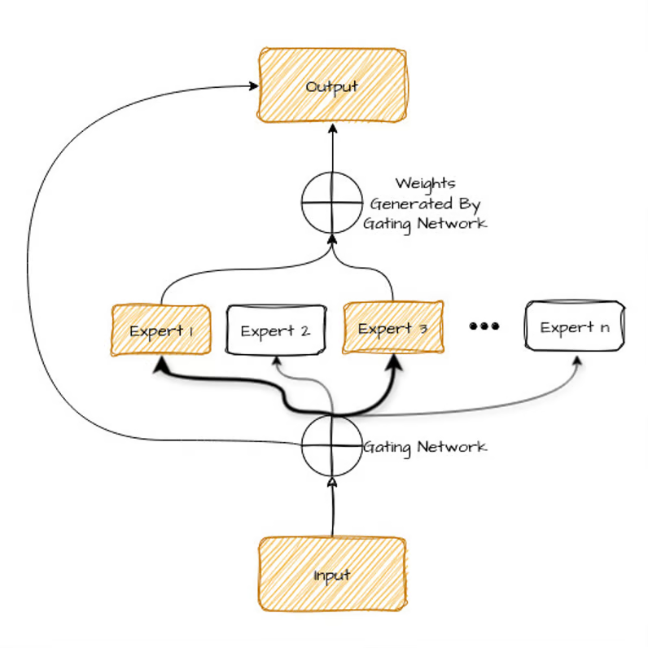

Mixture of Experts (MoE) is a machine learning technique where multiple specialized models (experts) work together, with a gating network selecting the best expert for each input.

What Is a Mixture of Experts (MoE)?
Imagine an AI model as a team of specialists, each with their own unique expertise. A mixture of experts (MoE) model operates on this principle by dividing a complex task among smaller, specialized networks known as “experts.”

Each expert focuses on a specific aspect of the problem, enabling the model to address the task more efficiently and accurately. It’s similar to having a doctor for medical issues, a mechanic for car problems, and a chef for cooking—each expert handles what they do best.

By collaborating, these specialists can solve a broader range of problems more effectively than a single generalist.

Let’s take a look at the diagram below—we’ll explain it shortly after.

Let’s break down the components of this diagram:

Input: This is the problem or data you want the AI to handle.
Experts: These are smaller AI models, each trained to be really good at a specific part of the overall problem. Think of them like the different specialists on your team.
Gating network: This is like a manager who decides which expert is best suited for each part of the problem. It looks at the input and figures out who should work on what.
Output: This is the final answer or solution that the AI model produces after the experts have done their work.
The advantages of using MoE are:

Efficiency: Only the experts who are good at a particular part of the problem are used, saving time and computing power.
Flexibility: You can easily add more experts or change their specialties, making the system adaptable to different problems.
Better results: Because each expert focuses on what they're good at, the overall solution is usually more accurate and reliable.
Let’s get into a little more detail with expert networks and gating networks.